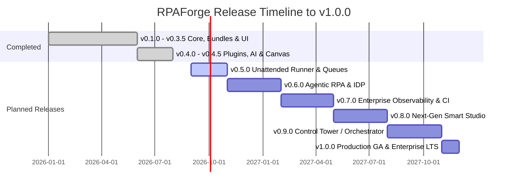

# RPAForge Roadmap: Path to v1.0.0 (Production GA)

## Executive Summary & Vision

**RPAForge** is an open-source, developer-first Robotic Process Automation (RPA) Studio and execution platform. Combining visual low-code workflow design with native Python power, modern developer ergonomics, and cutting-edge Agentic AI capabilities, RPAForge bridges the gap between brittle legacy enterprise RPA suites and modern software engineering practices.

- **Current Version**: v0.4.5 (Active Development & Stabilization)
- **Target for v1.0.0 GA**: Q4 2027
- **License**: Apache-2.0

---

## 2026–2027 RPA Industry Trends & Architectural Pillars

Our roadmap directly addresses the modern challenges and emerging paradigms of enterprise automation:

```
┌────────────────────────────────────────────────────────────────────────────────────────┐
│                                 RPAForge Ecosystem                                      │
├───────────────────────────────┬────────────────────────────────┬───────────────────────┤
│       Visual Studio IDE       │     Agentic & Hybrid Core      │ Control Tower & Fleet │
│  • XYFlow 12 Diagram Canvas   │  • Deterministic Engine        │ • Work Queues & Assets│
│  • Smart Multi-App Recorder   │  • LLM Tool Calling & Agents   │ • Unattended Runners  │
│  • Monaco Editor + Git Panel  │  • VLM Visual UI Grounding     │ • OpenTelemetry OTLP  │
│  • Real-Time Visual Debugger  │  • IDP Multi-Modal Extraction  │ • Centralized Web UI  │
└───────────────────────────────┴────────────────────────────────┴───────────────────────┘
```

1. **Agentic RPA & Hybrid Orchestration**: Moving beyond rigid, fragile scripts to hybrid workflows that pair deterministic rules with autonomous LLM reasoning, structured schema validation, and Vision-Language Model (VLM) element grounding when traditional UI selectors fail.
2. **Intelligent Document Processing (IDP)**: Native schema-driven extraction from unstructured invoices, receipts, contracts, and scans using multi-modal AI with zero third-party lock-in.
3. **Headless Unattended Execution**: First-class support for containerized, non-GUI execution in Docker, Linux servers, and CI/CD pipelines alongside traditional Windows desktop runners.
4. **Resilient Transaction Queues**: Standardized Dispatcher/Performer patterns with transactional locks, auto-retry, backoff, and dead-letter queues.
5. **Enterprise Security & Pluggable Secrets**: Zero-trust architecture with external secret providers (HashiCorp Vault, AWS Secrets Manager, Azure Key Vault), cryptographically signed packages, and non-leaking audit logs.
6. **Unified Observability**: Native OpenTelemetry (OTel) traces and metrics for every activity, workflow run, and robot worker.

---

## Release Status & Multi-Phase Roadmap



---

## Detailed Milestone Breakdown

### ✅ v0.4.x — AI Generation, XYFlow 12 & Plugin Architecture *(Current)*

- [x] **XYFlow 12 Migration**: Upgraded canvas engine with sub-diagram navigation, ELK automatic layout, and connection handles.
- [x] **AI-Powered Workflow Generation**: Prompt-to-diagram generation supporting OpenAI, Anthropic, Google Gemini, Ollama, and Groq with AST schema validation and self-correction.
- [x] **Plugin Architecture & SDK**: Entry-point based library auto-discovery (`rpaforge.libraries`), `@library` and `@activity` decorator suite, template examples, and documentation.
- [x] **Polars DataFrames Library**: 28 high-performance tabular data activities with visual table inspection in the debugger.
- [x] **Studio Git Integration**: Embedded source control panel for staging, committing, pushing, pulling, and branch management.
- [x] **PyInstaller Bundled Distribution**: Zero-dependency installer with embedded Python runtime, Chromium Playwright, and Tesseract OCR.
- [x] **Studio Ergonomics**: Command palette, customizable keyboard shortcuts, virtualized activity palette (`react-virtuoso`), and multi-language UI (EN, RU, DE, ES, ZH).

---

### 🚀 v0.5.0 — Unattended Execution & Resilient Work Queues *(Target: Q4 2026)*

**Goal**: Deliver production-ready unattended robot execution capabilities and transactional queue management for background automation.

#### 1. Headless Robot Runner Daemon & CLI (`rpaforge-runner`)
- Dedicated standalone CLI and background daemon for headless servers and Docker containers.
- Process supervisor with graceful shutdown (`SIGTERM`/`SIGINT`), worker isolation, and resource quotas (memory/CPU limits per robot).
- Cross-platform support (Windows Server, Linux x86_64/aarch64, macOS).
- Execution exit codes, machine-readable structured JSON outputs, and quiet execution modes.

#### 2. Transaction Work Queue Engine (Dispatcher / Performer)
- Transactional queue system supporting SQLite (local/embedded) and PostgreSQL backends.
- Item lifecycle states: `New` ➔ `InProgress` ➔ `Successful` / `Failed` / `Retried` ➔ `DeadLetter`.
- Distributed concurrency locks with automatic lease expiration and heartbeat renewal.
- Priority scheduling (High, Normal, Low), deferred execution timestamps, and exponential backoff retry.
- Visual Queue Monitor in Studio and dedicated Activity set: `Add Queue Item`, `Get Next Item`, `Set Item Status`, `Postpone Item`.

#### 3. Multi-Strategy Smart Selector Engine & Fallback Chain
- Hierarchical selector resolution:
  1. *Primary Selector* (UIAutomation / Playwright CSS/XPath / Accessibility ID)
  2. *Text & Relative Anchor* (e.g. "Label to the right of 'Invoice Total'")
  3. *Computer Vision / Template Match* (Fuzzy OpenCV matching with scale/DPI tolerance)
  4. *DOM/Tree Heuristic Fallback*
- Automatic confidence scoring and selector health warnings in Studio.

#### 4. Pluggable Enterprise Secret Providers
- Unified `CredentialsManager` interface with extensible backend adapters:
  - OS Keyring / Protected Storage (Default)
  - HashiCorp Vault (AppRole, Token, KV v2)
  - AWS Secrets Manager
  - Azure Key Vault
  - Environment / `.env` files for CI/CD
- Secure memory scrubbing for sensitive tokens and automatic masking in logs and audit trails.

#### 5. Self-Contained Project Packaging (`.forge` / `.rpa`)
- Portable archive packaging containing diagram JSON, sub-diagrams, variable schemas, lockfiles, and asset manifests.
- SHA-256 integrity verification and optional GPG/X.509 package signing.
- Fast package validation command (`rpaforge-runner validate package.forge`).

---

### 🤖 v0.6.0 — Agentic RPA & Intelligent Document Processing (IDP) *(Target: Q1 2027)*

**Goal**: Seamlessly combine deterministic RPA workflows with multi-modal LLM reasoning and document understanding.

#### 1. Agentic Workflow Nodes & Structured Decision Loops
- **LLM Decision Node**: Branch execution paths based on natural language conditions evaluated by LLMs.
- **Agentic Loop Block**: Autonomous agent execution block with user-defined allowed tools (activities), goal description, max iterations, and fallback safeguards.
- **JSON Schema Transformer**: Zero-shot extraction of unstructured text into strongly typed Pydantic / JSON-schema models.

#### 2. Native Intelligent Document Processing (IDP) Library
- Multi-format document parser: PDF (native text and scanned), TIFF, PNG, Word, Excel.
- Pre-built extraction schemas: Invoices, Receipts, Purchase Orders, ID Cards, Bank Statements.
- Table & Line-Item extractor with column alignment heuristics and confidence scores.
- Hybrid OCR pipeline: Fast local Tesseract/EasyOCR + Cloud VLM fallback for low-quality scans.

#### 3. VLM Visual UI Grounding & Self-Healing Locators
- Vision-Language Model element grounding (local Florence-2 / UI-TARS or cloud GPT-4o / Claude 3.5 Sonnet).
- Natural language element targeting: `Click on the 'Approve' button with a green icon`.
- Automatic self-healing: when selectors break after a software update, VLM proposes updated selectors during unattended execution and logs fix recommendations.

#### 4. Human-in-the-Loop (HITL) Workflow Hooks
- Interactive task forms with approval/rejection triggers.
- Multi-channel notification integrations: Slack, Microsoft Teams, Email (SMTP/Graph API), Webhooks.
- Workflow suspension & resumption tokens for long-running workflows awaiting human confirmation.

---

### 🛡️ v0.7.0 — Enterprise Observability, Security & CI/CD *(Target: Q2 2027)*

**Goal**: Provide enterprise-grade telemetry, compliance security profiles, and automated testing tools for professional development teams.

#### 1. Native OpenTelemetry (OTel) Distributed Tracing & Metrics
- Automatic trace generation: Span per workflow, sub-diagram, and activity execution with input/output metadata.
- Metric emitters: execution duration, error rate, queue item processing throughput, robot CPU/RAM usage.
- Native OTLP exporter to Jaeger, Prometheus, Datadog, Dynatrace, New Relic, and Grafana Tempo.

#### 2. Robot Sandbox & Security Execution Policies
- Permission boundaries per workflow (`rpaforge.policy.json`):
  - Allowed filesystem paths (read/write/deny).
  - Network egress allowlists (domains/IPs).
  - Allowed system commands and child processes.
- Audit log compliance with tamper-evident cryptographic chaining (HMAC audit log validation).

#### 3. Automated Workflow Testing Framework (`rpaforge-test`)
- Unit and integration testing for `.process` and `.forge` workflows.
- Activity Mocking & Stubbing (mock API responses, mock UI element states, simulated queue items).
- Test assertion activities: `Assert Variable Equals`, `Assert Activity Executed`, `Assert Table Matches`.
- Coverage reporter (node coverage, edge branch coverage).

#### 4. CI/CD Pipeline Integration & GitHub Actions
- Official GitHub Actions & GitLab CI templates for automated linting, security policy scanning, and headless test execution.
- Automated package building and publishing to internal/private artifact repositories.

---

### 🎨 v0.8.0 — Next-Gen Smart Studio & Interactive Debugging *(Target: Q3 2027)*

**Goal**: Deliver a world-class visual authoring experience with interactive real-time debugging and hybrid multi-application recording.

#### 1. Unified Hybrid Smart Recorder
- Multi-application session recording: automatically captures seamless sequences across Web browsers (Playwright), Windows Native apps (Win32, WPF, UIA3), and terminal consoles.
- Smart action deduplication (merging rapid keystrokes, ignoring incidental window focus events).
- Automatic generation of multi-strategy robust selectors with variable parameterization suggestions.

#### 2. Live Execution Rewind & Hot-Reload
- State checkpoint rewind: step backward to previous activity nodes during active debugging sessions without re-running preceding steps.
- Hot-reload & Edit-and-Continue: modify activity parameters or insert new nodes on the canvas while paused at a breakpoint and resume immediately.

#### 3. Visual Workflow Diffing & Merge Tool
- Visual side-by-side branch comparison for Git pull requests.
- Graphical merge conflict resolution for visual diagrams.
- Semantic change highlights (nodes added, edges modified, activity parameters changed).

#### 4. Reusable Component & Custom Activity Studio
- Visually wrap complex sub-diagrams into reusable Custom Activities with published input/output ports and custom icons.
- Publish custom components to local workspace or team repository with one click.

---

### 🌐 v0.9.0 — Control Tower / Orchestrator Platform *(Beta - Target: Q4 2027)*

**Goal**: Launch the centralized orchestration plane for managing robot fleets, scheduled jobs, and distributed automation pipelines.

```
                                 ┌─────────────────────────────┐
                                 │     Orchestrator Web UI     │
                                 │   Dashboard & Management    │
                                 └──────────────┬──────────────┘
                                                │ REST / WebSockets
┌───────────────────────────────────────────────▼───────────────────────────────────────────────┐
│                           RPAForge Control Tower Server                                       │
│  ┌────────────────────┐ ┌────────────────────┐ ┌────────────────────┐ ┌───────────────────┐  │
│  │ Schedule & Triggers│ │ Work Queue Manager │ │ Fleet Coordinator  │ │ Asset & Vault Mgr │  │
│  └────────────────────┘ └────────────────────┘ └────────────────────┘ └───────────────────┘  │
│                              PostgreSQL + Redis Backend                                       │
└───────┬───────────────────────────────────────┬───────────────────────────────────────┬───────┘
        │ mTLS / Secure Token                   │ mTLS / Secure Token                   │
┌───────▼──────────────┐                ┌───────▼──────────────┐                ┌───────▼──────────────┐
│  Robot Runner Node 1 │                │  Robot Runner Node 2 │                │  Robot Runner Node N │
│  (Windows Desktop)   │                │  (Linux Docker)      │                │  (Headless VM)       │
└──────────────────────┘                └──────────────────────┘                └──────────────────────┘
```

#### 1. Control Tower Core Server
- Modern async backend built with FastAPI, PostgreSQL, and Redis.
- Full OpenAPI / REST API and real-time WebSocket event bus.
- Multi-tenant architecture with organization and workspace isolation.

#### 2. Fleet Management & Secure Agent Pairing
- Instant runner agent auto-registration via one-time pairing tokens and mutual TLS (mTLS).
- Real-time heartbeat, status telemetry (Idle, Running, Error, Disconnected), and remote log streaming.
- Remote package deployment and automatic runner binary updates.

#### 3. Centralized Scheduling & Event Triggers
- Advanced cron schedules with timezone support, holiday calendars, and blackout windows.
- Event-driven triggers: Webhook receipt, email arrival, file system watch, queue threshold reached.

#### 4. Orchestrator Web Console
- Modern, responsive React dashboard.
- Real-time job timeline, live execution video/screenshot streaming, queue throughput graphs, and audit logs.

---

### 🏆 v1.0.0 — Production General Availability & Enterprise LTS *(Target: End of 2027)*

**Goal**: Full production-grade enterprise release with Long-Term Support (LTS), high availability, compliance, and enterprise migration tooling.

#### 1. High Availability (HA) & Clustering
- Zero-downtime multi-node Control Tower deployment with active-active clustering.
- Distributed lock manager and automatic failover for running jobs.

#### 2. Enterprise Identity & Governance (SSO / RBAC)
- SAML 2.0, OpenID Connect (OIDC), and LDAP/Active Directory integration (Okta, Azure AD, Keycloak).
- Granular Role-Based Access Control (Admin, Process Author, Operator, Auditor) with resource-level permissions.

#### 3. Cross-Platform Certified Parity
- 100% feature-complete certified runners for Windows 10/11/Server, Ubuntu/RHEL Linux, and macOS.
- Pre-configured, hardened Docker and Kubernetes Helm charts for instant cluster deployment.

#### 4. Enterprise Migration Assistant
- Automated migration tool for importing legacy automation assets from UiPath (`.xaml`), Robot Framework (`.robot`), and Automation Anywhere into native RPAForge workflows.

#### 5. Certified Community & Enterprise Marketplace
- Public and private marketplace for community libraries, certified enterprise connectors (SAP, Salesforce, Workday, ServiceNow), and industry project templates.

#### 6. Long-Term Support (LTS) & Stability SLA
- Guaranteed API stability and backward compatibility for all core engine, schema, and SDK interfaces.
- 3-year LTS maintenance window with regular security patches.

---

## Technical Specifications & Compatibility Matrix

| Component | Target Version | Supported Platforms | Key Dependencies |
|---|---|---|---|
| **Python Core Engine** | 3.10, 3.11, 3.12, 3.13 | Windows, Linux, macOS | `pydantic>=2.10`, `psutil>=5.9`, `opentelemetry-api` |
| **Studio Desktop IDE** | Electron 35+ / React 19 | Windows 10/11, macOS, Linux | `@xyflow/react>=12`, `monaco-editor`, `zustand>=5` |
| **Headless Runner** | Standalone Executable / Container | Windows Server, Linux (glibc/musl), Docker | Python 3.10+ runtime, `asyncio`, `click`/`typer` |
| **Control Tower** | Web / Containerized Cluster | Linux (Docker / K8s / Podman) | `FastAPI`, `SQLAlchemy>=2.0`, `PostgreSQL>=15`, `Redis>=7` |
| **Web Automation** | Chromium, Firefox, WebKit | Windows, Linux, macOS | `playwright>=1.51` |
| **Desktop Automation**| Win32, UIA, WPF, Java Access Bridge | Windows 10/11/Server | `pywinauto>=0.6.8`, `uiautomation>=2.0.22` |
| **Tabular & Data** | In-Memory DataFrames & Excel | All Platforms | `polars>=1.20`, `openpyxl>=3.1`, `xlwings>=0.34` |
| **AI / IDP** | OpenAI, Anthropic, Gemini, Ollama, VLM | All Platforms | Standardized REST / JSON-RPC / local ONNX |

---

## Immediate Next Steps (Milestone v0.5.0 Deliverables)

To achieve the nearest milestone (**v0.5.0**), development will focus on the following core tracks:

1. **Track 1**: Implement `rpaforge-runner` headless daemon and CLI with cross-platform support.
2. **Track 2**: Build the Transactional Work Queue Engine with SQLite/PostgreSQL storage.
3. **Track 3**: Implement the Multi-Strategy Smart Selector Engine with visual and anchor fallbacks.
4. **Track 4**: Integrate Pluggable Enterprise Secret Providers (HashiCorp Vault, AWS Secrets Manager, Azure Key Vault).
5. **Track 5**: Standardize `.forge` package bundling, validation, and cryptographic verification.
