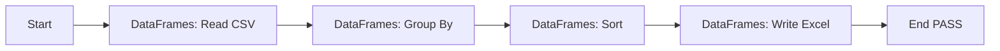

# Excel Report Generator

Offline tabular data aggregation and Excel report generation example for RPAForge (issue #755).

Demonstrates zero-environment automated reporting using the native `DataFrames` library powered by Polars and openpyxl: read a bundled CSV dataset, group and aggregate sales figures by category, sort the results, and export a clean Excel workbook.

No browser, no LLM endpoint required — runs 100% locally and offline.

## Workflow



## Files

| File | Purpose |
| --- | --- |
| `script.py` | Standalone runnable script using `DataFrames` |
| `process.json` | Visual diagram template in Studio `.process` format v1.1.0 |
| `sample/sales_data.csv` | Synthetic sales dataset fixture |
| `output/` | Destination folder receiving `report.xlsx` |

## Prerequisites

- Python 3.10+
- RPAForge packages installed with the `dataframes` optional dependency:

  ```bash
  pip install -e packages/core
  pip install -e "packages/libraries[dataframes]"
  ```

## SDK mode (guaranteed runnable)

Run directly from the repository root:

```bash
python examples/excel-report/script.py
```

This reads `examples/excel-report/sample/sales_data.csv` and produces `examples/excel-report/output/report.xlsx` containing the aggregated category revenue table:

| category | revenue |
| --- | --- |
| Electronics | 9575.00 |
| Furniture | 3600.00 |
| Supplies | 490.00 |

## Diagram mode (Studio)

1. Open RPAForge Studio.
2. Click **Import Process** and select `examples/excel-report/process.json`.
3. The workflow diagram will be loaded into the visual designer.
4. Click **Run** to execute the sequence in the Studio runner.
