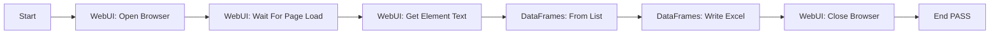

# Web Scraper to Excel

End-to-end template workflow for RPAForge (issue #729): open a demo HTML
table in a headless Chromium browser, extract it, store it as a DataFrame,
and export it to an Excel workbook.

## Workflow



The target page is [w3schools — HTML Tables](https://www.w3schools.com/html/html_tables.asp),
a stable practice page with an `<table id="customers">` element.

## Files

| File | Purpose |
| --- | --- |
| `script.py` | Fully runnable standalone script (direct library usage) |
| `process.json` | Visual diagram template in Studio `.process` format v1.1.0 |
| `output/` | Created on demand; receives `customers.xlsx` |

## Prerequisites

- Python 3.10+
- RPAForge packages installed from this repository:

  ```bash
  uv pip install -e packages/core
  uv pip install -e packages/libraries
  ```

- Web automation extras (Playwright + browser binaries):

  ```bash
  uv pip install "rpaforge-libraries[web]"
  playwright install chromium
  ```

- DataFrames extras (Polars, used by the `DataFrames` library):

  ```bash
  uv pip install "rpaforge-libraries[dataframes]"
  ```

## Run the Python script

From the repository root:

```bash
python examples/web-scraper-to-excel/script.py
```

Expected output:

```
Opening https://www.w3schools.com/html/html_tables.asp
Saved 7 rows to D:\...\examples\web-scraper-to-excel\output\customers.xlsx
```

The script instantiates `rpaforge_libraries.WebUI` and
`rpaforge_libraries.DataFrames` directly, closes the browser in a
`try/finally`, and validates that extracted headers match expectations.

## Run via CLI / Studio

- **CLI (headless):**

  ```bash
  rpaforge run examples/web-scraper-to-excel/process.json --json
  ```

- **Studio:** open `process.json` via *File → Open Process* to inspect and
  edit the diagram.

> **Note:** the WebUI library does not yet ship a dedicated
> *Extract Table* activity, so the parsing step demonstrated by
> `parse_table_text()` in `script.py` has no visual block counterpart.
> In the diagram, the `From List` node reads the `${tableRows}` process
> variable; wire your own parsing activity (or extend WebUI) to populate
> it before unattended runs. `script.py` is the complete working reference.

## Customize

- Change `TARGET_URL` / `TABLE_SELECTOR` / `HEADERS` at the top of
  `script.py` to scrape another table whose markup puts every cell on its
  own source line.
- Swap the output format: `DataFrames` also offers `Write CSV`
  (`frames.write_csv(...)`) with identical call shape.
